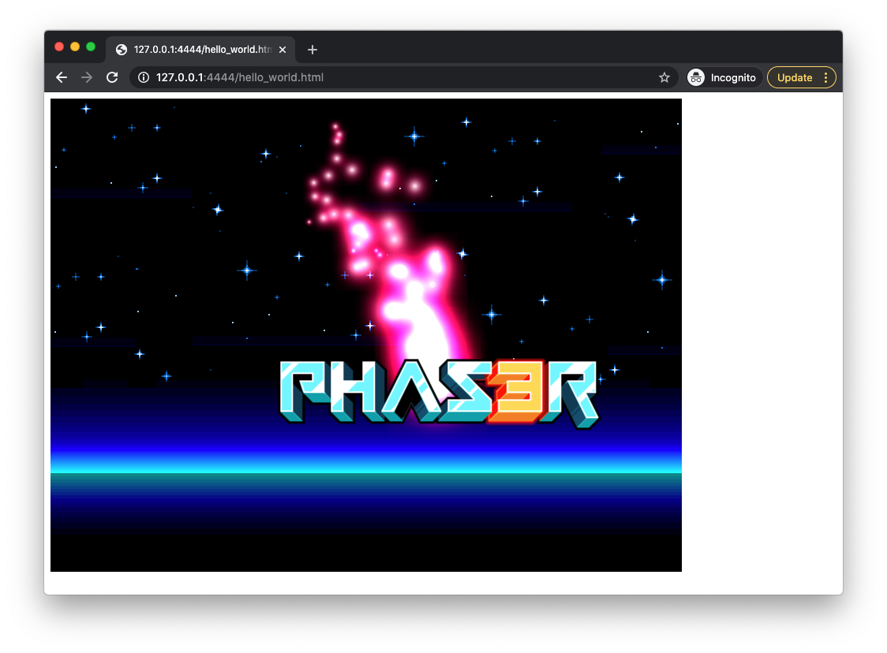
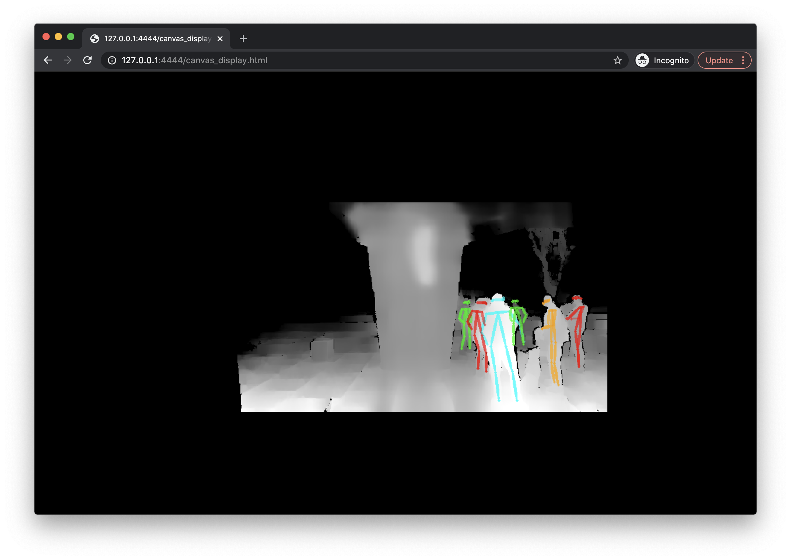
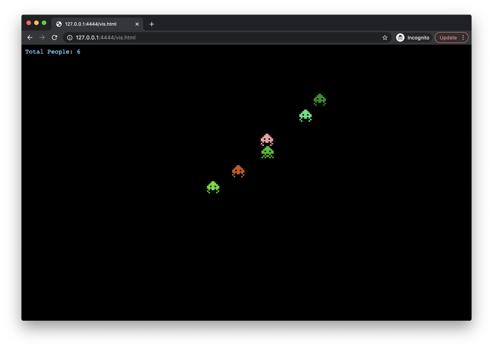
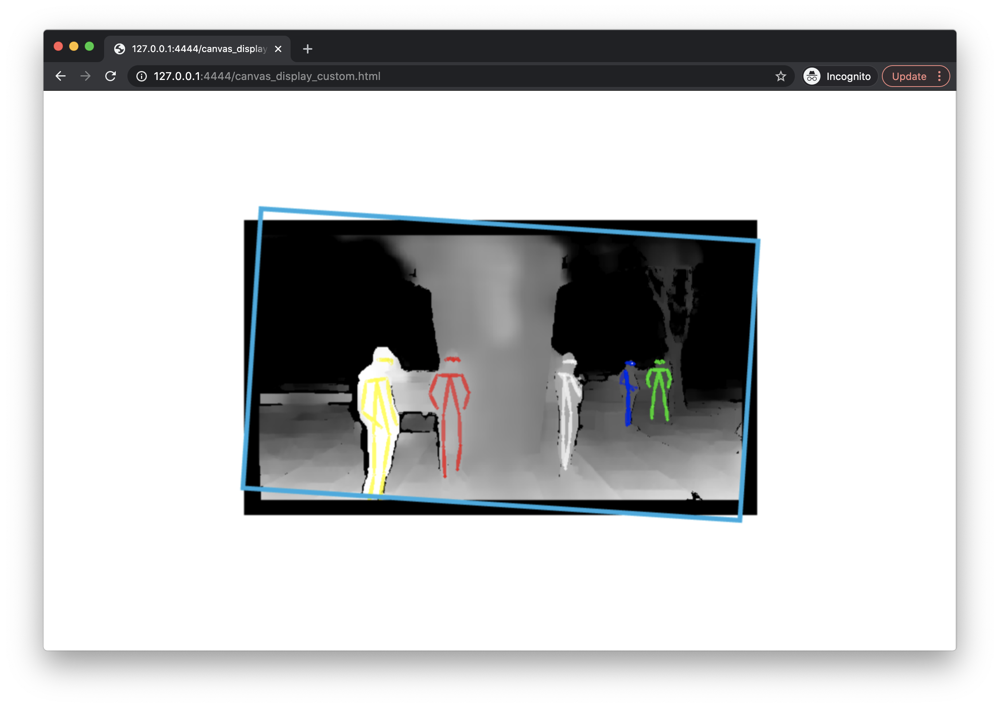

# A Phaser 3 HCI Project Demo

This code shows how to create a simple [Phaser 3](https://phaser.io/) application using Javascript. Many Phaser 3 tutorials can be found [here](https://phaser.io/tutorials/getting-started-phaser3/).

## Example websites

### Phaser Hello World

You can test the [Phaser 3 Hello World!](https://phaser.io/tutorials/getting-started-phaser3/part5) sample by opening the `hello_world.html` file in a browser. You should then see:



### Canvas inside of Phaser

Note that you can include HTML5 [canvas elements](https://www.w3schools.com/html/html5_canvas.asp) inside of Phaser 3 games. The canvas can be then used
as a texture for images. An example is provided in the `canvas_display.html` file. If you open this example in a browser, you should then see:



### Alien visualization

This sample project also includes a phaser game where the position of people in front of the CEID is visualized with alien sprites.
Open the `vis.html` example in a browser. You should then see:



### Using your own assets

The prior examples show you how to create simple Phaser 3 games using assets hosted online already. What if you wanted to use your own assets? You would need to host them on a web server.

Run a simple Python 3 server to host the image files needed for this Phaser 3 project:

```python
$ python3 -m http.server [-b ADDRESS] [port]
```

For example, the command `python3 -m http.server -b 127.0.0.1 4444` would run the server on the local host using port 4444. Once the server is running, you should be able to access it via a browser at `http://ADDRESS:port`, such as http://127.0.0.1:4444.

Once the server is running, open `http://127.0.0.1:4444/canvas_display_custom.html`. Then you should see a similar demo to the prior canvas example, but now the depth image is surrounded by a custom frame hosted by the Python server.




